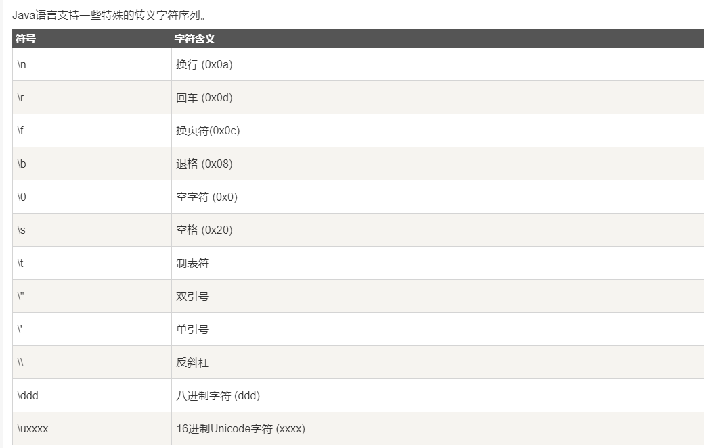

## Java

### 一. 环境下载
1. 安装JDK: https://www.oracle.com/java/technologies/javase-downloads.html
2. 卸载JDK旧版本: https://www.oracle.com/java/technologies/javase-jdk14-downloads.html
3. 安装破解版IDEA: https://www.zdfans.com/html/53688.html

### 二.环境变量配置
1. JAVA_HOME: 如：F:\JAVA\JDK，即JDK包安装路径
2. CLASSPATH: .;%JAVA_HOME%\lib\dt.jar;%JAVA_HOME%\lib\tools.jar
3. PATH: 新建，%JAVA_HOME%\bin
4. 启动cmd，查看java是否安装了：java -version，查看javac是否配置了：javac
````cmd
java -version
javac

````

### 三. JAVA语法基础

##### (一) Hello World
1. 代码
````java

public class HelloWorld {
    public static void main(String []args) {
        System.out.println("Hello World");
    }
}

````
2. 运行规则：启动cmd
````cmd

javac HelloWorld.java
java HelloWorld

```` 


##### (二) 对象和类

````java

/* 实例化对象 */
Object referenceVariable = new Constructor();
/* 访问类中的变量 */
referenceVariable.variableName;
/* 访问类中的方法 */
referenceVariable.methodName();

````

````cmd

javac -encoding UTF-8 Puppy.java // 以UTF-8编码编译
java Puppy

````

````

###### 1. 源文件声明规则
- 一个源文件中只能有一个public类
- 一个源文件可以有多个非public类
- 源文件的名称应该和public类的类名保持一致。例如：源文件中public类的类名是Employee，那么源文件应该命名为Employee.java
- 如果一个类定义在某个包中，那么package语句应该在源文件的首行。
- 如果源文件包含import语句，那么应该放在package语句和类定义之间。如果没有package语句，那么import语句应该在源文件中最前面。
- import语句和package语句对源文件中定义的所有类都有效。在同一源文件中，不能给不同的类不同的包声明。

###### 2. Java包
- 包主要用来对类和接口进行分类。当开发Java程序时，可能编写成百上千的类，因此很有必要对类和接口进行分类。

###### 3. Import语句
- 在Java中，如果给出一个完整的限定名，包括包名、类名，那么Java编译器就可以很容易地定位到源代码或者类。Import语句就是用来提供一个合理的路径，使得编译器可以找到某个类。
  例如，下面的命令行将会命令编译器载入java_installation/java/io路径下的所有类
  ````cmd
  
  import java.io.*;
  
  ````

###### 4. 简单例子
````java
import java.io.*;
public class Employee{ }
````

````java
import java.io.*;
public class EmployeeTest{}
````

````cmd

javac -encoding UTF-8 Employee.java // 以UTF-8编码编译
javac -encoding UTF-8 EmployeeTest.java // 以UTF-8编码编译
java EmployeeTest

````

##### (三) 基本数据类型
######1. 数据类型：①内置数据类型；②引用数据类型

######2. 内置数据类型：
- Java语言提供了八种基本类型。六种数字类型（四个整数型，两个浮点型），一种字符类型，还有一种布尔型。

① byte
- byte 数据类型是8位、有符号的，以二进制补码表示的整数；
- 最小值是 -128（-2^7）；
- 最大值是 127（2^7-1）；
- 默认值是 0；
- byte 类型用在大型数组中节约空间，主要代替整数，因为 byte 变量占用的空间只有 int 类型的四分之一；
- 例子：byte a = 100，byte b = -50。

② short
- short 数据类型是 16 位、有符号的以二进制补码表示的整数
- 最小值是 -32768（-2^15）；
- 最大值是 32767（2^15 - 1）
- Short 数据类型也可以像 byte 那样节省空间。一个short变量是int型变量所占空间的二分之一；
- 默认值是 0；
- 例子：short s = 1000，short r = -20000。

③ int
- int 数据类型是32位、有符号的以二进制补码表示的整数；
- 最小值是 -2,147,483,648（-2^31）；
- 最大值是 2,147,483,647（2^31 - 1）；
- 一般地整型变量默认为 int 类型；
- 默认值是 0 ；
- 例子：int a = 100000, int b = -200000。

④ long
- long 数据类型是 64 位、有符号的以二进制补码表示的整数；
- 最小值是 -9,223,372,036,854,775,808（-2^63）；
- 最大值是 9,223,372,036,854,775,807（2^63 -1）
- 这种类型主要使用在需要比较大整数的系统上；
- 默认值是 0L；
- 例子： long a = 100000L，Long b = -200000L。"L"理论上不分大小写，但是若写成"l"容易与数字"1"混淆，不容易分辩。所以最好大写。

⑤ float
- float 数据类型是单精度、32位、符合IEEE 754标准的浮点数；
- float 在储存大型浮点数组的时候可节省内存空间；
- 默认值是 0.0f；
- 浮点数不能用来表示精确的值，如货币；
- 浮点数不能用来表示精确的值，如货币；

⑥double
- double 数据类型是双精度、64 位、符合IEEE 754标准的浮点数；
- 浮点数的默认类型为double类型；
- double类型同样不能表示精确的值，如货币；
- 默认值是 0.0d；
- 例子：double d1 = 123.4。

⑦ boolean
- boolean数据类型表示一位的信息
- 只有两个取值：true 和 false；
- 这种类型只作为一种标志来记录 true/false 情况；
- 默认值是 false；
- 例子：boolean one = true。

⑧ char
- char类型是一个单一的 16 位 Unicode 字符；
- 最小值是 \u0000（即为0）；
- 最大值是 \uffff（即为65,535）；
- char 数据类型可以储存任何字符；
- 例子：char letter = 'A';

3. 实例
````java

public class PrimitiveTypeTest {}

````

###### 3. 引用数据类型：
````

- 在Java中，引用类型的变量非常类似于C/C++的指针。引用类型指向一个对象，指向对象的变量是引用变量。这些变量在声明时被指定为一个特定的类型，比如 Employee、Puppy 等。变量一旦声明后，类型就不能被改变了。
- 对象、数组都是引用数据类型。
- 所有引用类型的默认值都是null。
- 一个引用变量可以用来引用任何与之兼容的类型。
- 一个引用变量可以用来引用任何与之兼容的类型。

````

###### 4. 声明常量
````java

final double PI = 3.1415927; // 常量名通常大写

````

###### 5. 类型转换

1. [自动类型转换](https://www.runoob.com/java/java-basic-datatypes.html)
````

低  ------------------------------------>  高

byte,short,char—> int —> long—> float —> double 

````

2. [强制类型转换](https://www.runoob.com/java/java-basic-datatypes.html)
- 1. 条件是转换的数据类型必须是兼容的。
- 2. 格式：(type)value type是要强制类型转换后的数据类型 实例：
````java

public class ZiDongLeiZhuan{
        public static void main(String[] args){
            char c1='a';//定义一个char类型
            int i1 = c1;//char自动类型转换为int
            System.out.println("char自动类型转换为int后的值等于"+i1);
            char c2 = 'A';//定义一个char类型
            int i2 = c2+1;//char 类型和 int 类型计算
            System.out.println("char类型和int计算后的值等于"+i2);
        }
}

````

3. 隐含强制类型转换
- 整数的默认类型是 int
- 浮点型不存在这种情况，因为在定义 float 类型时必须在数字后面跟上 F 或者 f。

###### 6.特殊的转义字符序列
