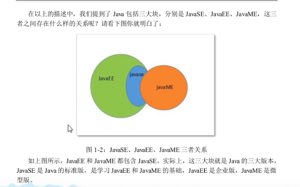
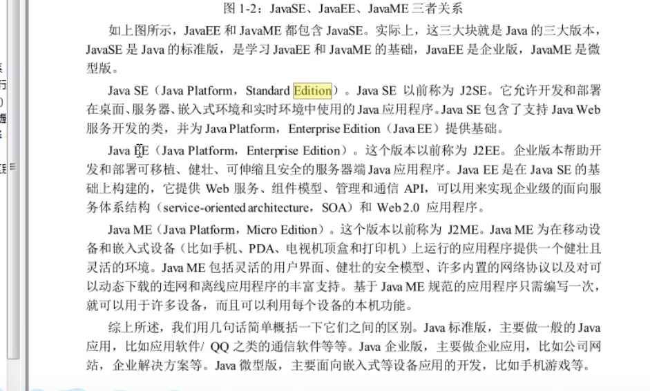
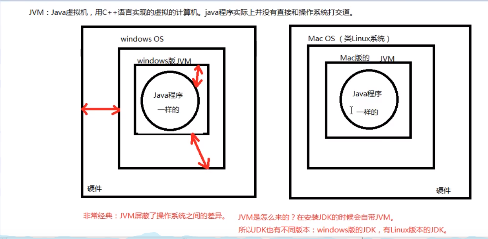
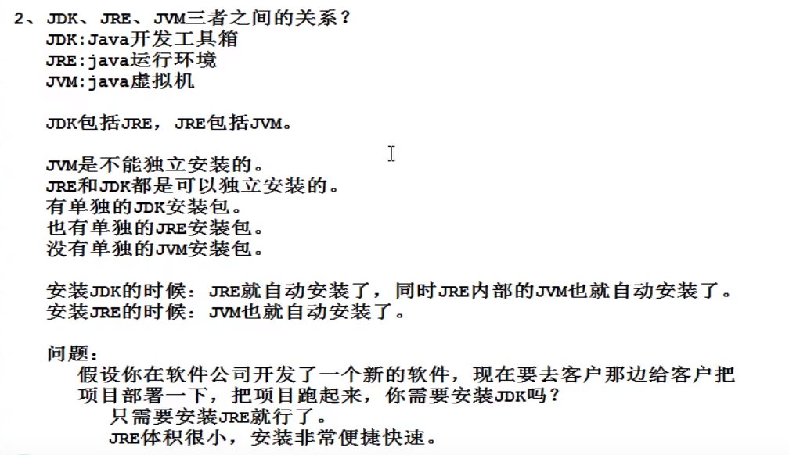
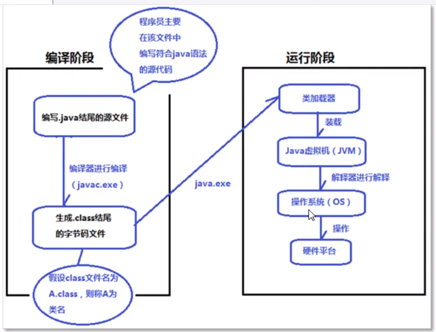
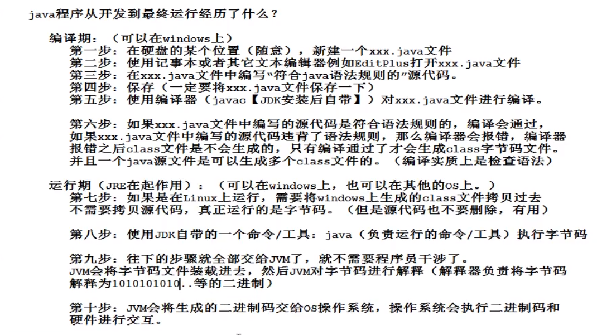

## Java Introduce

### 一. [DOS常用命令](https://blog.csdn.net/weixin_43306844/article/details/86615870)
```

mkdir abc // 创建abc目录


d: e: // 进入d盘,e盘

dir  // 查看当前目录有什么文件和文件夹

cls // 清屏

cd 


```

### 二. ipconfig：查看ip配置

```

 ipconfig
 ipconfig/all // 更多IP配置

```

### 三. ping:[ ip地址/域名] - 看是否能访问服务器

```

ping www.baidu.com

ping www.baidu.com -t // 检查网路是否稳定

```

### 四. java介绍

#### 1. javaEE, javaSE,javaME关系
- 图1
 
<br/>

- 图2
 

#### 2. java语言特性
- 简单性
- 面向对象 
- 健壮性
- java完全/完美支持多线程并发
- 可移植性/跨平台（一次编写，到处运行，因为JVM,Java虚拟机，底层C++，支持多平台）

#### 3. JVM-Java虚拟机



#### 4. JDK、JRE、JVM三者之间的关系


#### 5. java编译与执行过程（注：字节码不是二进制）
- 1



<br />
<br />

- 2




### 五.环境变量配置
参考文件——见环境变量配置：[环境变量配置](./README.md)


### 六.缩进
向左缩进：Shift + Tab
向右缩进：Tab

